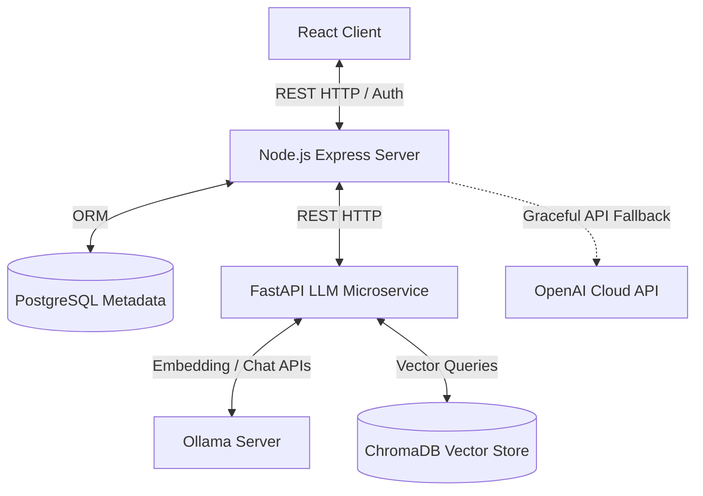

# 🚀 NexaFlow AI

[](https://react.dev)
[](https://fastapi.tiangolo.com)
[](https://expressjs.com)
[](https://prisma.io)
[](https://trychroma.com)
[](https://docker.com)

**NexaFlow AI** is an enterprise-grade, all-in-one AI automation platform designed for modern businesses. It provides a suite of 15+ AI-powered modules covering spreadsheets, PDF documents, email generation, copy writing, and template orchestration. 

At its core, the platform operates on a **self-hosted Retrieval-Augmented Generation (RAG)** pipeline utilizing local Large Language Models (LLMs) and vector embeddings, guaranteeing absolute data privacy and substantial API cost reductions compared to public cloud alternatives.

---

## 🗺️ Architectural Topology

NexaFlow AI is built as a microservices architecture to ensure scalability, ease of development, and strict separation of concerns.



---

## 🌟 Modules & Features

### 📄 PDF Intelligence Hub
* **PDF Brain:** Get rapid summary reports and key insight breakdowns of uploaded manuals, contracts, or long reports.
* **PDF Chat Agent:** Converse directly with your documents. Ask questions, seek verification, and trace exact citations.
* **Smart Data Extractor:** Automatically parse unstructured PDFs to pull structured fields (e.g., invoices, dates, amounts) into clean JSON data.
* **Bulk PDF Toolkit:** Process multiple files in batch pipelines.

### 📊 Excel Genius Suite
* **AI Sheet Summarizer:** Synthesize sheets to understand data ranges, column schemas, and summary tables.
* **Formula Master:** Convert plain-english commands into correct Excel or Google Sheets formulas.
* **Error & Trend Detector:** Surface data anomalies, logical calculation errors, and future predictions.

### 🧠 AI Workmate
* **AI Chat:** A persistent chat dashboard featuring user prompt templates, search utilities, and conversation logging.
* **Multi-Turn Context:** Preserves conversation threads using PostgreSQL state logs.

### ✉️ MailCraft AI & Social Pro
* **Email Wizard:** Create drafts matching customized tones, contexts, or email lengths.
* **CaptionPro & Ad Generator:** Build highly converting captions, advertisements, and optimized hashtag listings.

---

## 🛠️ Technology Stack

| Layer | Technology | Key Usage |
| :--- | :--- | :--- |
| **Frontend** | React 18, TypeScript, Tailwind CSS, Vite | Responsive dashboard UI, charts, and file upload systems |
| **Backend** | Node.js, Express.js, TypeScript | API routing, JWT session validation, user limits, payment webhook |
| **Database** | PostgreSQL, Prisma ORM | Stores accounts, chat histories, transactions, and usage quotas |
| **AI Service** | FastAPI (Python 3.10+), Uvicorn | High-performance embedding orchestration, chunking, and RAG routing |
| **Vector DB** | ChromaDB | High-speed similarity search for user document vectors |
| **Local LLM** | Ollama (`llama3.2`, `nomic-embed-text`) | Local vectorization and local text generation |
| **Infrastructure** | Docker & Docker Compose | Multi-container setups for Postgres, Redis, ChromaDB, and Ollama |

---

## ⚙️ Quick Start (Local Setup)

### Prerequisites
* **Node.js:** v18+
* **Python:** v3.10+
* **Docker & Docker Compose** installed and running.

---

### Step 1: Clone and Install Dependencies

```bash
# Clone the repository
git clone https://github.com/yourusername/nexaflow-ai.git
cd nexaflow-ai

# Install Backend dependencies
cd backend && npm install

# Install Frontend dependencies
cd ../frontend && npm install

# Install LLM FastAPI dependencies
cd ../llm-service/llm-ms && pip install -r requirements.txt
```

---

### Step 2: Spin Up Infrastructure Containers

Run the core Docker containers (PostgreSQL, Redis, ChromaDB, and Ollama). This command downloads and boots all required services:

```bash
cd .. # Back to the project root
docker compose up -d
```

*(Note: The Ollama container is pre-configured in [docker-compose.yml](file:///Users/sivansrawat/Documents/NexaFlow-AI/docker-compose.yml) to automatically pull `llama3.2:latest` and `nomic-embed-text:latest` on startup).*

---

### Step 3: Run Migrations and Set Environment Variables

1. Populate the database schema using Prisma:
```bash
cd backend
npx prisma db push
```

2. Duplicate the environment configuration template:
   * Rename `.env.example` files in both the `backend` and `frontend` folders to `.env`.
   * Add your Google OAuth keys and Razorpay secrets in `backend/.env`.

---

### Step 4: Launch Applications

Start the developments servers in three separate terminal screens:

#### 1. Backend Server
```bash
cd backend
npm run dev
```
*App launches at:* `http://localhost:5000`

#### 2. LLM Microservice
```bash
cd llm-service/llm-ms
python run.py
```
*App launches at:* `http://localhost:8001` (Docs at `http://localhost:8001/docs`)

#### 3. Frontend Web Dashboard
```bash
cd frontend
npm run dev
```
*App launches at:* `http://localhost:3000`

---

## 🔍 Ingestion & Query Verification (RAG Testing)

You can quickly verify that the FastAPI RAG service is working independently using `curl` commands:

### 1. Ingest a Test Document Chunk
```bash
curl -X POST http://localhost:8001/api/rag/ingest \
  -H "Content-Type: application/json" \
  -d '{
    "document_id": "doc_test_101",
    "document_text": "NexaFlow AI has recorded a net profit of 1.2 million dollars for Q2 of 2026.",
    "collection_name": "user_demo_documents"
  }'
```

### 2. Query the Knowledge Base (Retrieval Search)
```bash
curl -X POST http://localhost:8001/api/rag/query \
  -H "Content-Type: application/json" \
  -d '{
    "query": "How much profit was recorded for Q2?",
    "collection_name": "user_demo_documents"
  }'
```

---

## 📂 Project Structure Map

```
nexaflow-ai/
├── backend/                  # Node.js + Express API
│   ├── src/
│   │   ├── controllers/      # Route controllers (AI, PDF, auth, etc.)
│   │   ├── middlewares/      # Security, limit checks, and JWT auth
│   │   └── services/         # Clients for LLM and RAG Python services
│   ├── prisma/               # PostgreSQL schema declaration
│   └── package.json          # Node dependencies (see backend/package.json)
│
├── frontend/                 # React client
│   ├── src/
│   │   ├── components/       # Reusable views (PDF toolkit, Excel optimizer, etc.)
│   │   ├── context/          # Auth state managers
│   │   └── lib/              # API and helper utilities
│   └── package.json          # React dependencies (see frontend/package.json)
│
├── llm-service/llm-ms/       # Python FastAPI AI service
│   ├── app/
│   │   ├── routes/           # FastAPI router endpoints (RAG, Chat completions)
│   │   └── services/         # Vector searches, chunking, and Ollama clients
│   └── requirements.txt      # Python dependencies
│
├── grafana/                  # System monitoring configurations
├── docker-compose.yml        # Orchestration script for services
├── install.sh                # Automation setup shell script
└── README.md                 # Project guide
```

---

## 📈 Monitoring & Health Checking
* The system is provisioned to support telemetry using **Prometheus** and **Grafana** (configured in the `grafana` directory).
* To track active load, spin times, and database metrics, uncomment the `prometheus` and `grafana` services in [docker-compose.yml](file:///Users/sivansrawat/Documents/NexaFlow-AI/docker-compose.yml) and launch.
* A live health check is exposed at `http://localhost:8001/api/llm/health`.

---

## 📄 License
Licensed under the [MIT License](LICENSE).
