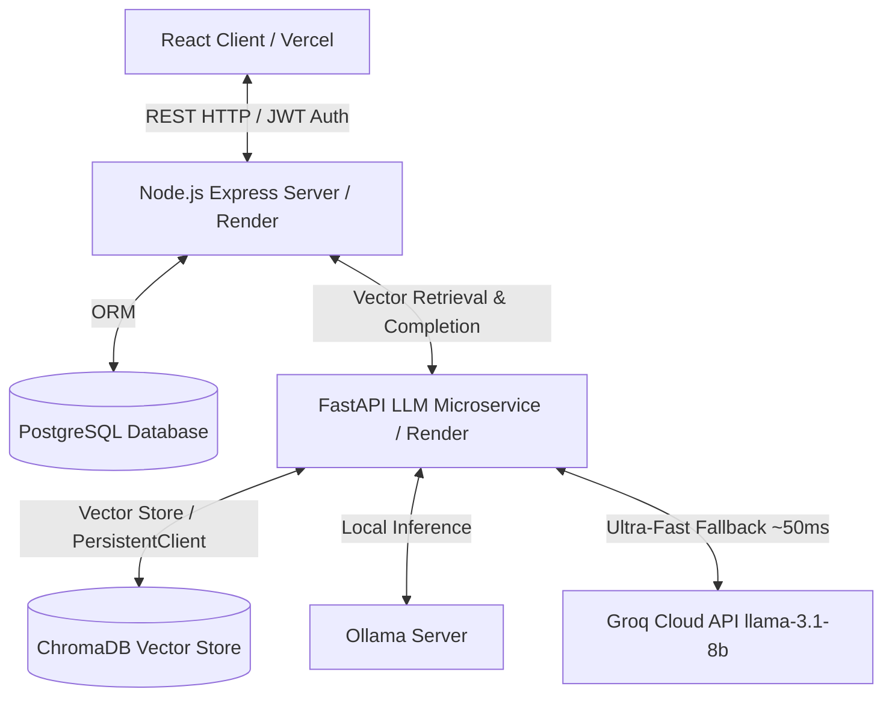

# 🚀 NexaFlow AI

[](https://react.dev)
[](https://fastapi.tiangolo.com)
[](https://expressjs.com)
[](https://prisma.io)
[](https://trychroma.com)
[](https://docker.com)

**NexaFlow AI** is an enterprise-grade, all-in-one AI automation platform designed for modern businesses. It provides a suite of 15+ AI-powered modules covering spreadsheets, PDF documents, email generation, copywriting, and document orchestration.

At its core, the platform operates on a **Universal Retrieval-Augmented Generation (RAG)** pipeline powered by **ChromaDB vector stores** and a **High-Speed Hybrid LLM engine** (Local Ollama + Groq Cloud API fallback), guaranteeing 100% availability and ultra-low latency response times.

---

## 🌐 Live Production Deployments

* **Frontend Dashboard (Vercel):** [https://nexa-flow-ai.vercel.app](https://nexa-flow-ai.vercel.app)
* **Backend REST API (Render):** [https://nexaflow-ai.onrender.com](https://nexaflow-ai.onrender.com)
* **LLM & RAG Microservice (Render):** [https://nexaflow-llm-service.onrender.com](https://nexaflow-llm-service.onrender.com)

---

## 🗺️ Architectural Topology

NexaFlow AI is built as a microservices architecture to ensure scalability, fault tolerance, and clean separation of concerns.



---

## 🌟 Tool Suites & Universal RAG Architecture

Every module across NexaFlow AI is integrated with live vector search and RAG retrieval:

### 📄 PDF Intelligence Hub (Full Document RAG)
* **PDF Brain:** Ingests long manuals, contracts, or financial reports into ChromaDB (`documents` collection) to generate key summaries and structural breakdowns.
* **PDF Chat Agent:** Converse directly with uploaded PDF documents. Searches vector embeddings to retrieve exact snippets and return precise citations.
* **Smart Data Extractor:** Parses unstructured PDFs to pull structured JSON fields (invoices, dates, line items).

### ✉️ MailCraft AI Suite (Template RAG)
* **Email Wizard:** Queries `mailcraft_templates` vector store for AIDA, PAS, and B2B cold email frameworks before generating customized email drafts.
* **Subject Line Optimizer:** Queries open-rate subject line formulas to generate high-converting subject lines.
* **Tone Polisher:** Retrieves executive tone rules and grammar enhancement guidelines to refine user text.

### 📱 SocialPro AI Suite (Viral Hooks RAG)
* **CaptionPro & Post Generator:** Queries `socialpro_templates` for viral openers, pattern-interrupt hooks, and call-to-action formulas.
* **Ad Copy Generator:** Retrieves high-converting Meta and LinkedIn ad copy frameworks.
* **Hashtag Strategist:** Queries hashtag categorization benchmarks to maximize post reach.

### 📬 Bulk Mailer AI (Sequence RAG)
* **Smart Sequence Engine:** Queries `bulkmailer_templates` for multi-touch cold outreach sequences (Intro ➔ Follow-up ➔ Value Add ➔ Breakup).
* **MailMerge & Personalization:** Interpolates dynamic user tags with verified email templates.

### 📝 SmartDocs Suite (Corporate Templates RAG)
* **Smart Invoice Generator:** Queries `smartdocs_templates` for professional corporate invoice structures and line-item formatting.
* **Offer Letter Generator:** Retrieves employment contract and offer letter legal guidelines.

### 📊 Excel Genius Suite (Formula & Analysis RAG)
* **Formula Master:** Queries `excel_templates` for advanced formulas (XLOOKUP, INDEX/MATCH, SUMIFS, IFERROR).
* **Error & Trend Detector:** Retrieves data cleaning heuristics (#N/A, #VALUE!, #REF!) and trend prediction models.
* **AI Sheet Summarizer:** Synthesize spreadsheet schemas and summary statistics.

---

## 🛠️ Technology Stack

| Layer | Technology | Key Usage |
| :--- | :--- | :--- |
| **Frontend** | React 18, TypeScript, Vanilla CSS, Vite | Glassmorphic dashboard UI, charts, and file upload systems |
| **Backend** | Node.js, Express.js, TypeScript | REST APIs, JWT session validation, user limits, payment webhooks |
| **Database** | PostgreSQL, Prisma ORM | Stores accounts, chat logs, transactions, and usage quotas |
| **AI Microservice** | FastAPI (Python 3.10+), Uvicorn | Embedding orchestration, document chunking, and RAG routing |
| **Vector DB** | ChromaDB (`PersistentClient`) | In-memory & persistent vector search stored in writeable storage |
| **LLM Engine** | Local Ollama + Groq Cloud API | Hybrid LLM inference (`llama-3.1-8b-instant` fallback) |
| **Infrastructure** | Render, Vercel, Docker Compose | Automated CI/CD deployment pipelines |

---

## ⚙️ Quick Start (Local Setup)

### Prerequisites
* **Node.js:** v18+
* **Python:** v3.10+
* **Docker & Docker Compose** installed and running.

---

### Step 1: Clone and Install Dependencies

```bash
# Clone the repository
git clone https://github.com/SivansRawat/NexaFlow-AI.git
cd NexaFlow-AI

# Install Backend dependencies
cd backend && npm install

# Install Frontend dependencies
cd ../frontend && npm install

# Install LLM FastAPI dependencies
cd ../llm-service/llm-ms && pip install -r requirements.txt
```

---

### Step 2: Spin Up Infrastructure Containers

```bash
cd .. # Back to the project root
docker compose up -d
```

---

### Step 3: Run Database Migrations

```bash
cd backend
npx prisma db push
```

---

### Step 4: Launch Applications

Start the development servers in separate terminal screens:

#### 1. Backend Server
```bash
cd backend
npm run dev
# App launches at: http://localhost:5000
```

#### 2. LLM Microservice
```bash
cd llm-service/llm-ms
python run.py
# App launches at: http://localhost:8001 (Docs at http://localhost:8001/docs)
```

#### 3. Frontend Web Dashboard
```bash
cd frontend
npm run dev
# App launches at: http://localhost:3000
```

---

## 🔍 Verification & RAG Retrieval Testing

You can verify that vector retrieval is working live using `curl` against the deployed LLM service:

### 1. Test MailCraft RAG Retrieval (`mailcraft_templates`)
```bash
curl -X POST https://nexaflow-llm-service.onrender.com/api/rag/retrieve \
  -H "Content-Type: application/json" \
  -d '{"query":"sales email","collection_name":"mailcraft_templates","n_results":2}'
```

### 2. Test SocialPro RAG Retrieval (`socialpro_templates`)
```bash
curl -X POST https://nexaflow-llm-service.onrender.com/api/rag/retrieve \
  -H "Content-Type: application/json" \
  -d '{"query":"instagram viral hook","collection_name":"socialpro_templates","n_results":1}'
```

### 3. Test Excel Genius RAG Retrieval (`excel_templates`)
```bash
curl -X POST https://nexaflow-llm-service.onrender.com/api/rag/retrieve \
  -H "Content-Type: application/json" \
  -d '{"query":"VLOOKUP formula error","collection_name":"excel_templates","n_results":1}'
```

### 4. Test PDF Brain Ingestion & RAG Query (`documents`)
```bash
# Ingest PDF Document
curl -X POST https://nexaflow-llm-service.onrender.com/api/rag/ingest \
  -H "Content-Type: application/json" \
  -d '{
    "document_id": "pdf_doc_101",
    "document_text": "NexaFlow Secret Protocol Code: NF-ALPHA-998877.",
    "metadata": {"source": "manual.pdf"}
  }'

# Query PDF Document RAG Answer
curl -X POST https://nexaflow-llm-service.onrender.com/api/rag/query \
  -H "Content-Type: application/json" \
  -d '{
    "query": "What is the secret protocol code?",
    "collection_name": "documents",
    "n_context_chunks": 1
  }'
```

---

## 📂 Project Structure Map

```
NexaFlow-AI/
├── backend/                  # Node.js + Express API
│   ├── src/
│   │   ├── controllers/      # RAG & AI Controllers (MailCraft, SocialPro, Excel, SmartDocs)
│   │   ├── middlewares/      # Security, rate limits, and JWT auth
│   │   └── services/         # LLM service wrappers & Axios clients
│   ├── prisma/               # PostgreSQL schema declaration
│   └── package.json          # Node dependencies
│
├── frontend/                 # React client
│   ├── src/
│   │   ├── components/       # Glassmorphic views (PDF toolkit, Excel optimizer, MailCraft)
│   │   ├── context/          # Auth context state managers
│   │   └── lib/              # API and helper utilities
│   ├── vercel.json           # Vercel SPA rewrite routing
│   └── package.json          # React dependencies
│
├── llm-service/llm-ms/       # Python FastAPI AI microservice
│   ├── app/
│   │   ├── routes/           # FastAPI routers (Chat, RAG retrieval & ingestion)
│   │   └── services/         # Vector search, ChromaDB PersistentClient, Groq fallback
│   ├── Dockerfile            # Production Docker build spec
│   └── requirements.txt      # Python dependencies
│
├── vercel.json               # Root Vercel SPA routing
├── docker-compose.yml        # Infrastructure orchestration
└── README.md                 # Project guide
```

---

## 📄 License
Licensed under the [MIT License](LICENSE).
